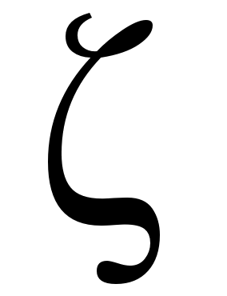

zeta-learn: Python Machine Learning Library
===========================================

zeta-learn is a minimalistic python machine learning library designed to deliver
fast and easy model prototyping.

zeta-learn aims to provide an extensive understanding of machine learning through
the use of straightforward algorithms and readily implemented examples making
it a useful resource for researchers and students.

Find this project on `GitHub`_

* **Python versions:** 3.4 and above
* **Free software:** MIT license

.. _GitHub: https://github.com/jefkine/zeta-learn

Dependencies
------------
* numpy >= 1.19.0
* scikit-learn >= 0.18.0
* matplotlib >= 2.0.0

Features
--------

* ``Keras`` like ``Sequential`` api for building models.
* Built on NumPy and matplotlib
* Examples folder with readily implemented machine learning models.

.. toctree::
   :maxdepth: 1
   :caption: Featured Models

   writeups/tutorials/perceptron
   writeups/tutorials/cnn

.. toctree::
   :maxdepth: 1
   :caption: API

   writeups/api/activations
   writeups/api/objectives
   writeups/api/optimizers
   writeups/api/regularizers
   writeups/api/initializers

.. toctree::
   :maxdepth: 1
   :caption: Support

   writeups/general/support

Indices and tables
==================

* :ref:`genindex`
* :ref:`modindex`
* :ref:`search`
