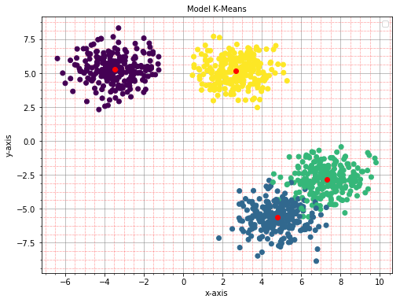
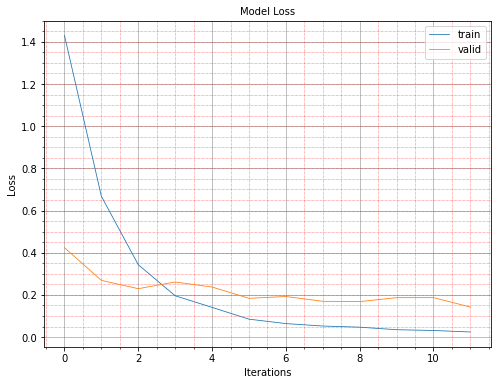
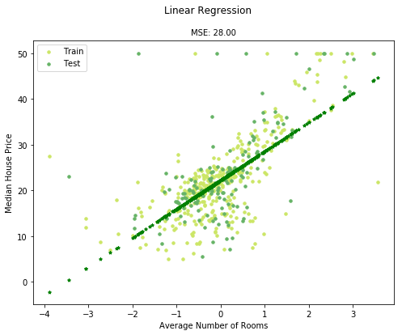
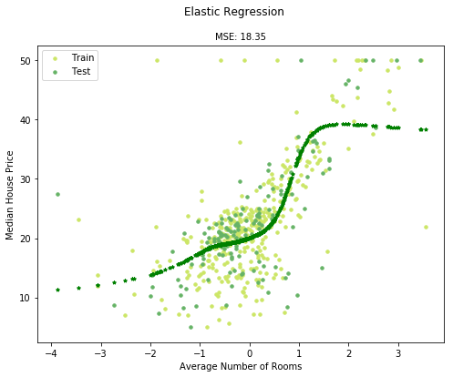

Featured Examples
=================

Principal Component Analysis (PCA)
##################################

`DIGITS Dataset - PCA <https://github.com/jefkine/zeta-learn/blob/master/examples/digits/digits_pca.py>`_

.. image:: ../../img/digits_pca.png
      :align: center
      :alt: digits pca

`MNIST Dataset - PCA <https://github.com/jefkine/zeta-learn/blob/master/examples/mnist/mnist_pca.py>`_

.. image:: ../../img/mnist_pca.png
      :align: center
      :alt: mnist pca

KMEANS
######

`K-Means Clustering (4 Clusters) <https://github.com/jefkine/zeta-learn/blob/master/examples/clusters/kmeans_cluestering.py>`_

Convolutional Neural Network (CNN)
##################################

`DIGITS Dataset Model Summary <https://github.com/jefkine/zeta-learn/blob/master/examples/digits/digits_cnn.py>`_

.. code:: html

  DIGITS CNN

  Input Shape: (1, 8, 8)
  +---------------------+---------+--------------+
  ¦ LAYER TYPE          ¦  PARAMS ¦ OUTPUT SHAPE ¦
  +---------------------+---------+--------------+
  ¦ Conv2D              ¦     320 ¦   (32, 8, 8) ¦
  ¦ Activation: RELU    ¦       0 ¦   (32, 8, 8) ¦
  ¦ Dropout             ¦       0 ¦   (32, 8, 8) ¦
  ¦ BatchNormalization  ¦   4,096 ¦   (32, 8, 8) ¦
  ¦ Conv2D              ¦  18,496 ¦   (64, 8, 8) ¦
  ¦ Activation: RELU    ¦       0 ¦   (64, 8, 8) ¦
  ¦ MaxPooling2D        ¦       0 ¦   (64, 7, 7) ¦
  ¦ Dropout             ¦       0 ¦   (64, 7, 7) ¦
  ¦ BatchNormalization  ¦   6,272 ¦   (64, 7, 7) ¦
  ¦ Flatten             ¦       0 ¦     (3,136,) ¦
  ¦ Dense               ¦ 803,072 ¦       (256,) ¦
  ¦ Activation: RELU    ¦       0 ¦       (256,) ¦
  ¦ Dropout             ¦       0 ¦       (256,) ¦
  ¦ BatchNormalization  ¦     512 ¦       (256,) ¦
  ¦ Dense               ¦   2,570 ¦        (10,) ¦
  +---------------------+---------+--------------+

  TOTAL PARAMETERS: 835,338

DIGITS Dataset Model Results
############################
.. image:: ../../img/digits_cnn_tiled_results.png
      :align: center
      :alt: digits cnn results tiled

DIGITS Dataset Model Loss
#########################

DIGITS Dataset Model Accuracy
#############################
.. image:: ../../img/digits_cnn_accuracy_graph.png
      :align: center
      :alt: digits model accuracy

`MNIST Dataset Model Summary <https://github.com/jefkine/zeta-learn/blob/master/examples/mnist/mnist_cnn.py>`_

.. code:: html

  MNIST CNN

  Input Shape: (1, 28, 28)
  +---------------------+------------+--------------+
  ¦ LAYER TYPE          ¦     PARAMS ¦ OUTPUT SHAPE ¦
  +---------------------+------------+--------------+
  ¦ Conv2D              ¦        320 ¦ (32, 28, 28) ¦
  ¦ Activation: RELU    ¦          0 ¦ (32, 28, 28) ¦
  ¦ Dropout             ¦          0 ¦ (32, 28, 28) ¦
  ¦ BatchNormalization  ¦     50,176 ¦ (32, 28, 28) ¦
  ¦ Conv2D              ¦     18,496 ¦ (64, 28, 28) ¦
  ¦ Activation: RELU    ¦          0 ¦ (64, 28, 28) ¦
  ¦ MaxPooling2D        ¦          0 ¦ (64, 27, 27) ¦
  ¦ Dropout             ¦          0 ¦ (64, 27, 27) ¦
  ¦ BatchNormalization  ¦     93,312 ¦ (64, 27, 27) ¦
  ¦ Flatten             ¦          0 ¦    (46,656,) ¦
  ¦ Dense               ¦ 11,944,192 ¦       (256,) ¦
  ¦ Activation: RELU    ¦          0 ¦       (256,) ¦
  ¦ Dropout             ¦          0 ¦       (256,) ¦
  ¦ BatchNormalization  ¦        512 ¦       (256,) ¦
  ¦ Dense               ¦      2,570 ¦        (10,) ¦
  +---------------------+------------+--------------+

  TOTAL PARAMETERS: 12,109,578

MNIST Dataset Model Results
###########################
.. image:: ../../img/mnist_cnn_tiled_results.png
      :align: center
      :alt: mnist cnn results tiled

Regression
##########

`Linear Regression <https://github.com/jefkine/zeta-learn/blob/master/examples/boston/boston_linear_regression.py>`_

`Polynomial Regression <https://github.com/jefkine/zeta-learn/blob/master/examples/boston/boston_polynomial_regression.py>`_

.. image:: ../../img/polynomial_regression.png
      :align: center
      :alt: polynomial regression

`Elastic Regression <https://github.com/jefkine/zeta-learn/blob/master/examples/boston/boston_elastic_regression.py>`_

