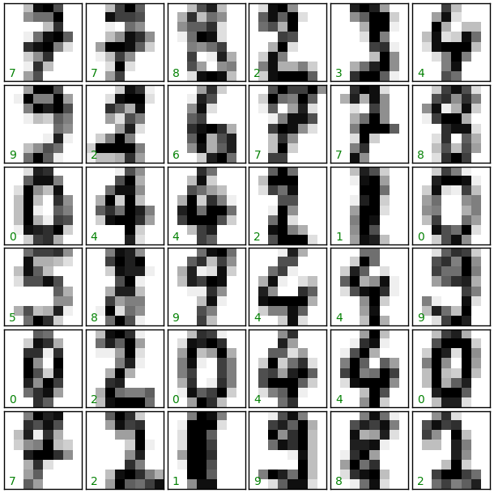

Convolutional Neural Networks (CNNs)
====================================

Convolutional neural networks (CNNs) are a biologically-inspired variation of the
multilayer perceptrons (MLPs). Neurons in CNNs share weights unlike in MLPs where
each neuron has a separate weight vector. This sharing of weights ends up
reducing the overall number of trainable weights hence introducing sparsity.

zeta-learn utilizes the ``Sequential`` model api to help you build up a convolutional
neural network with ease as we will demonstrate below.

We shall use MNIST, a dataset of handwritten digits with 60,000 training samples,
and 10,000 test samples. Each image is represented by 28x28 pixels, with each
containing a value 0 - 255 with its grayscale value.

zeta-learn has a function which enables us to visualize samples of the MNIST dataset

.. code-block:: python

    from sklearn import datasets
    from zeta.utils import plot_mnist_img_results

    plot_mnist_img_samples(datasets.load_digits())

The visuals generated from the above code snippet will look like the one below:

.. figure:: ../../img/mnist_samples.png
    :width: 300px
    :align: center
    :height: 300px
    :alt: mnist samples
    :figclass: align-center

Our full CNN model from zeta-learn will be as follows

.. literalinclude:: ../../../examples/mnist/mnist_cnn.py
   :language: python

The CNN model attains 99.33% accuracy with the results obtained plotted below:

References:
  * `Convolutional Neural Networks UFLDL Tutorial`_
  * `Convolutional Neural Networks (LeNet)`_
  * `Backpropagation in Convolutional Neural Networks`_
  * `Convolutional Neural Networks (CNNs / ConvNets)`_

.. _Convolutional Neural Networks UFLDL Tutorial: http://ufldl.stanford.edu/tutorial/supervised/ConvolutionalNeuralNetwork/
.. _Convolutional Neural Networks (LeNet): http://deeplearning.net/tutorial/lenet.html
.. _Backpropagation in Convolutional Neural Networks: http://www.jefkine.com/general/2016/09/05/backpropagation-in-convolutional-neural-networks/
.. _Convolutional Neural Networks (CNNs / ConvNets): http://cs231n.github.io/convolutional-networks/
